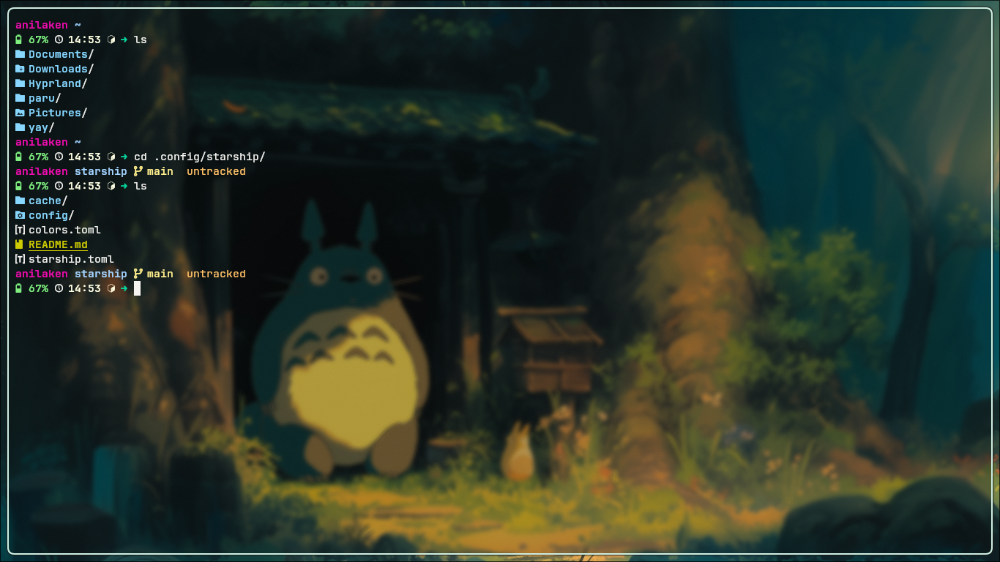

# Starship Terminal Customization

#### Lu bisa baca dokumentasinya di sini: https://starship.rs/guide/

 

## Cara Menggunakan File Konfigurasi

### Prerequisites
Install <a href="https://www.nerdfonts.com/">Nerd Font</a> dulu dan aktifkan di terminal. Kalau ingin cari iconnya bisa di sini <a href="https://www.nerdfonts.com/cheat-sheet">Nerd Font Icon</a>. Jika udah semuanya lanjut ke tahap berikutnya, yaitu install <a href="https://starship.rs/">Starship</a>.

Note: cara ini hanya untuk konfigurasi di linux.

### Screenshot

### Demo
<video width="400" controls>
  <source src="./assets/demo.mp4" type="mp4">
</video>

### 1. Install Starship
Install pake package manager, kalau di Arch Linux pake pacman.
<pre>sudo pacman -S starship</pre>

## 2. Buat File Konfigurasi
Buat file konfigurasinya di ~/.config/ dan buat file dengan nama starship.toml
<pre>
touch ~/.config/starship.toml # kalo pake bawaan linux
nvim ~/.config/starship.toml  # kalo pake neovim
nano ~/.config/starship.toml  # kalo pake nano
</pre>

## 3. Clone Repo
Clone repo ini ke dalam fodler yang telah dibuat sebelumnya.
<pre>git clone https://github.com/patriciaanggraeni/starship-config.git</pre>

## 4. Merge File
Karena basisnya pake rust, jadi nggak support modular. Ngatasinya harus di-merge secara manual.
<pre>cat file_one.toml file_two.toml file_three.toml >> ~/.config/starship.toml</pre>

Note: ganti file_one, file_two, ... dengan nama file mu sendiri dan jalankan perintah ini di dalam folder yang sama.

### 5 Inisialisasi Script
Inisialisasikan script starship.toml ke ./bashrc agar dapat dieksekusi setiap kali membuka teminal. Paste kode ini di dalam file ~/.bashrc dan reaload file menggunakan perintah source.
<pre>eval "$(starship init bash)"</pre>
Lalu reaload file
<pre>source .bashrc</pre>